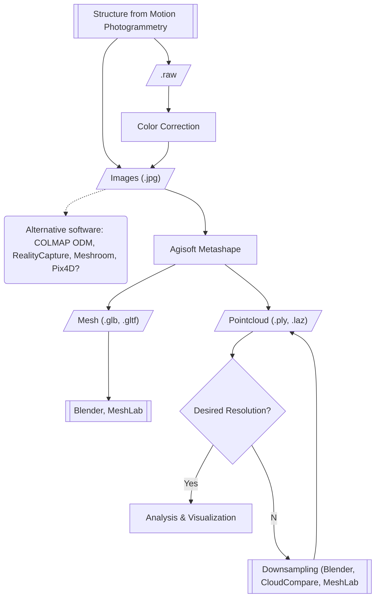

# reefVR
Workflows for reef photogrammetry.

```mermaid
flowchart TD
n1[["Structure from Motion Photogrammetry"]]-->n2[/".raw"/]
n2-->n12["Color Correction"]
n1-->n3[/"Images (.jpg)"/]
n12-->n3
n3-.->n5("Alternative software: COLMAP ODM, RealityCapture, Meshroom, Pix4D?")
n3-->n4["Agisoft Metashape"]
n4-->n6[/"Mesh (.glb, .gltf)"/]
n6-->n7[["Blender, MeshLab"]]
n4-->n8[/"Pointcloud (.ply, .laz)"/]
n8-->n9{"Desired Resolution?"}
n9 --No-->n10[["Downsampling (Blender, CloudCompare, MeshLab"]]
n9--Yes-->n11["Analysis & Visualization"]
n10-->n8
```
